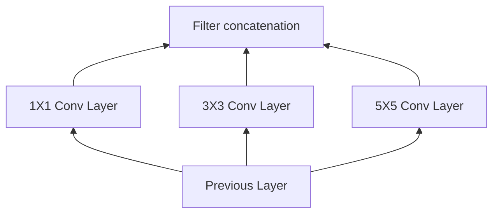

### Basic Git Bash
```shell
git clone link

git add *
git commit -m "update"
git push

git pull

git reset commit_id # return to the status before that commit
git rm -r --cached # remove cache
```

### Markdown
:smiley: [emoticon](https://gist.github.com/rxaviers/7360908)

```
hyperlink    [link name](link)
image        
new line     <br/>
empty space  &nbsp;
```

```
```diff
+ Green
- Red
! Orange
@@ Pink @@
# Gray
```

```

